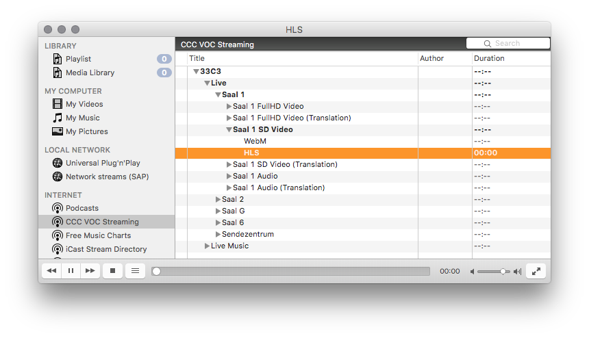

## VLC service discovery of CCC VOC event streams

[CCC VOC](https://github.com/voc) provides live streaming of [Chaos Computer Club](https://www.ccc.de/en/) events, OSS related conferences and [other nerdy stuff](https://streaming.media.ccc.de). This script implements automatic service discovery of these streams in the [VLC media player](http://www.videolan.org/vlc/index.html).



### Installation

Get a terminal and download the script

````bash
curl -O https://raw.githubusercontent.com/agnat/c3voc-vlc-sd/master/c3voc.lua
````

#### Linux

````bash
mkdir -p ~/.local/share/vlc/lua/sd
mv c3voc.lua ~/.local/share/vlc/lua/sd/
````

#### Mac OS

````bash
mkdir -p ~/Library/Application\ Support/org.videolan.vlc/lua/sd
mv c3voc.lua ~/Library/Application\ Support/org.videolan.vlc/lua/sd/
````

#### Windows

Download the script by any means necessary. Then move it to `%APPDATA%\vlc\lua\sd` ... I think.

### Kown Issues

VLC service discovery scripts are not truely dynamic. They only fetch content once on first view. On Mac OS I found a trick to re-trigger the script.

1. Deselect the "CCC VOC Streaming" entry in the sidebar. (Select "Podcasts" or something)
1. Right-click on "CCC VOC Streaming" and disable it.
1. Select "CCC VOC Streaming" again. This re-enables the script and triggers a reload.

### Unkown Issues

Fork and fix or file an issue.
