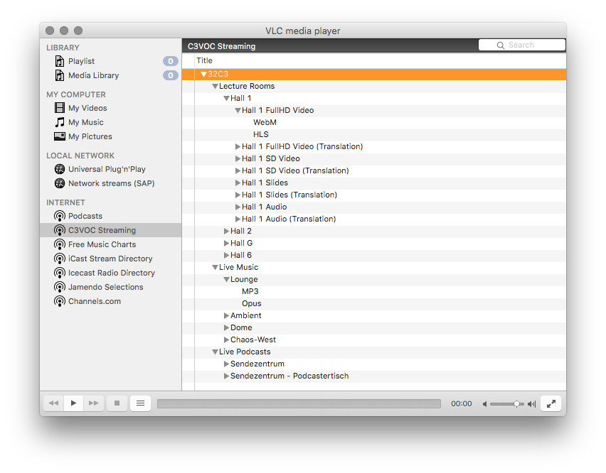

### VLC service discovery of C3VOC event streams

C3VOC provides live streaming of [Chaos Computer Club](https://www.ccc.de/en/) events and [other OSS related conferences](https://streaming.media.ccc.de). This script implements automatic service discovery of these streams in the [VLC media player](http://www.videolan.org/vlc/index.html).

... or [on Ubuntu](doc/images/vlc_c3voc_sd_ubuntu.png)

#### Installation

Unfortunately VLC does not execute service discovery scripts from your local VLC configuration directory. You've got to plomp the script into a system/application folder:

 * Mac OS X: `cp lua/sd/c3voc.lua /Applications/VLC.app/Contents/MacOS/share/lua/sd/`
 * Ubuntu: `cp lua/sd/c3voc.lua /usr/lib/vlc/lua/sd/`

Note: Currently the script renders _static demo content_. To play with an actual [voc/streaming-website](https://github.com/voc/streaming-website) adjust the `streams_url` variable in [lua/sd/c3voc.lua](lua/sd/c3voc.lua#L6).

#### Kown Issues

VLC service discovery scripts are not truely dynamic. They only fetch content once on first view. On Mac OS I found a trick to re-trigger the script.

1. Deselect the "C3VOC Streaming" entry in the sidebar. (Select "Podcasts" or something)
1. Right-click on "C3VOC Streaming" and disable it.
1. Select "C3VOC Streaming" again. This re-enables the script and triggers a reload.

#### Unkown Issues

Fork and fix or file an issue.
